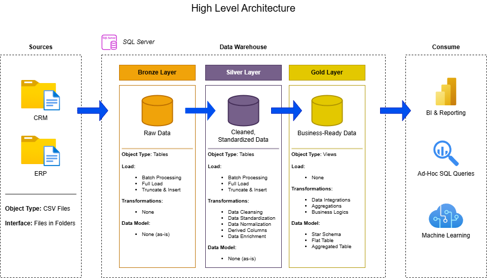

# Data Warehouse and Analytics Project
This is a project for practice of full SQL project, starting from building the data warehouse (data engineering) to the data analysis parts.
It was completed as a part of SQL Full Course by Data With Baraa (Link: https://youtu.be/SSKVgrwhzus?si=9AMsBHLfSZNUNKDe)

---
## Project Overview

This project involves:

1. **Data Architecture**: Designing a Modern Data Warehouse Using Medallion Architecture **Bronze**, **Silver**, and **Gold** layers.
2. **ETL Pipelines**: Extracting, transforming, and loading data from source systems into the warehouse.
3. **Data Modeling**: Developing fact and dimension tables optimized for analytical queries.
4. **Analytics & Reporting**: Creating SQL-based reports and dashboards for actionable insights.

---
## Project Requirements
## Phase 1: Build Data Warehouse (Data Engineering)

### Objective
- Develop a modern data warehouse using SQL Server to consolidate sales data, enabling analytical reporting and informed decision-making.

### Specifications
- Data Sources:
    - Import data from 2 source systems (ERP and CRM) provided as CSV files
- Data Quality:
    - Cleanse and resolve data quality issues prior to analysis
- Integration:
    - Combine both sources into a single, user-friendly data model designed for analytical queries
- Scope:
    - Focus on the latest dataset only
    - Historization of data is not required
- Documentation:
    - Provide clear documentation of the data model to support both business stakeholders and analytics teams

## Phase 2: BI, Analytics & Reporting (Data Analysis)

### Objective
- Develop SQL-based analytics to deliver detailed insights into:
    - Customer Behavior
    - Product Performance
    - Sales Trends
- These insights empower stakeholders with key business metrics, enabling strategic decision-making.

---
## Data Architecture

The data architecture for this project follows Medallion Architecture **Bronze**, **Silver**, and **Gold** layers:

1. **Bronze Layer**: Stores raw data as-is from the source systems. Data is ingested from CSV Files into SQL Server Database.
2. **Silver Layer**: This layer includes data cleansing, standardization, and normalization processes to prepare data for analysis.
3. **Gold Layer**: Houses business-ready data modeled into a star schema required for reporting and analytics.
